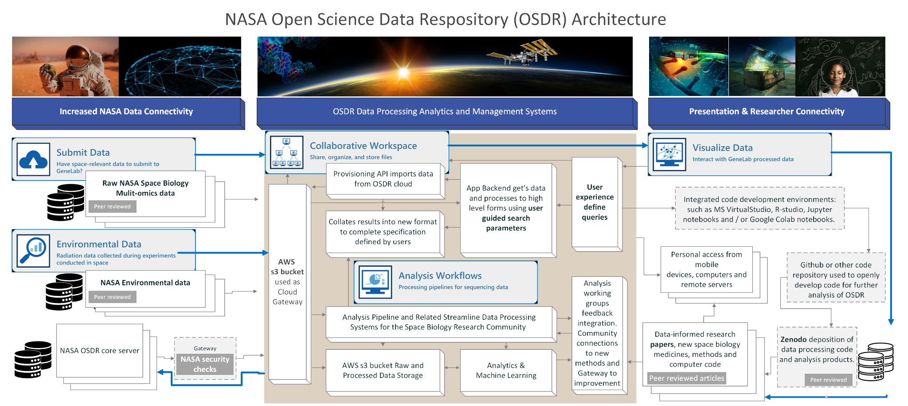
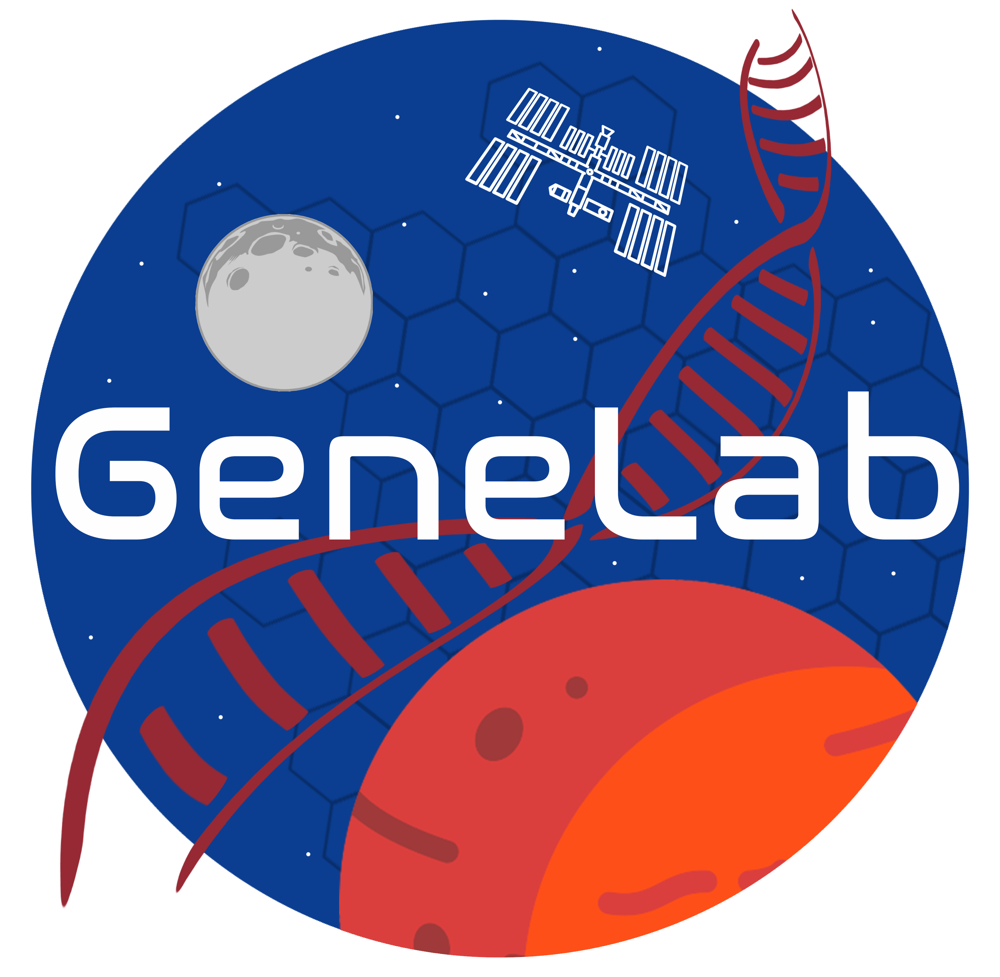

# Welcome to NASA GeneLab and the Open Science Archive



Welcome to NASA GeneLab and the open Science Archive - the first comprehensive space-related omics database; users can upload, download, share, store, and analyze spaceflight and spaceflight-relevant data from experiments using model organisms.

#### OSDR Home page 

[Learn more GeneLab](https://genelab.nasa.gov/about): GeneLab, an open science multi-omics repository, covering transcriptomics, metagenomics, epigenomics, proteomics, and metabolomics. Studies comprise of data from model organisms including microbes, plants, fruit flies, rodents and humans.

[Learn more about BSP](https://science.nasa.gov/biological-physical/space-biology-biospecimen-sharing-program): The NASA Space Biology Biospecimen Sharing Program (BSP) collects biospecimens to maximize the scientific return from biological spaceflight and associated ground investigations and to encourage and broaden participation from the scientific community in space biology-related research.

[Learn more about ALSDA](https://osdr.nasa.gov/bio/about/alsda.html): Ames Life Sciences Data Archive (ALSDA) collects, curates, and makes available space-relevant higher-order phenotypic datasets. Datasets that enable scientists to perform retrospective analysis across missions, experiments, life science disciplines, research subjects, and species.

[Learn more about NBISC](https://osdr.nasa.gov/bio/about/nbisc.html): NASA Biological Institutional Scientific Collection (NBISC) is a biorepository of non-human samples collected from NASA-funded spaceflight investigations and correlative ground studies. The purpose of NBISC is to receive, store, document, preserve, and make the collection available to the scientific community.

<figure><figcaption>
The diagram shows three main columns: Increased NASA data connectivity, Data Processing Systems, and Presentation &#x26; Researcher Connectivity. The Data Processing, Analytics, and Management column shows how raw and processed NASA data is stored in a secure AWS bucket. It also shows how data is ingested, processed, and analyzed using analysis workflows. The Presentation &#x26; Researcher Connectivity column shows how researchers can access NASA data. The diagram also shows how new code generated by analysis of OSDR data can be shared through GitHub and published data products can be shared through Zenodo.
</figcaption></figure>

<figure><figcaption>
NASA GeneLab is inspirational.
</figcaption></figure>
